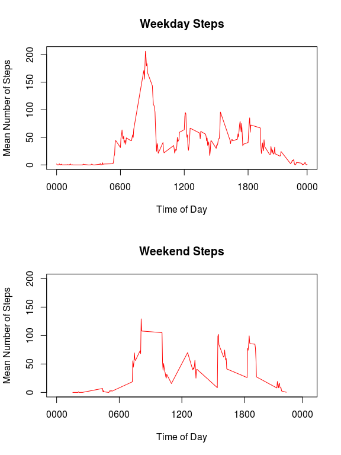

# Reproducible Research: Peer Assessment 1


## Loading and preprocessing the data

The activity data used in this exercise is downloaded and read in to the data frame _activity_. 


```r
  download.file("http://d396qusza40orc.cloudfront.net/repdata%2Fdata%2Factivity.zip","activity.zip",method="auto")
  unzip("activity.zip")
  activity <- read.csv("activity.csv",header=TRUE)
```

The _dplyr_ library is used in this analysis. 


```r
  library(dplyr, warn.conflicts=FALSE)
```

# Exploratory plots

Exploratory data analysis was carried out without accounting for NA values, except by using _na.rm = TRUE_ as an option. 

Initially, a histogram was made to show the frequency of days with a given number of steps. The recommended minimum number of steps taken daily is 10,000. When missing values are ignored, 25 out of the 61 days fall below this limit. 

```r
  hist_data <- summarise(group_by(activity,date),sum(steps,na.rm=TRUE))
  hist(unlist(hist_data[,2]),col=c("Red","Green","Blue"),xlab="Total Number of Steps",ylab="Number of Days",main="Frequency of Total Number of Steps per Day")
```

 


The total number of missing values is 2304: 


```r
  print(sum(is.na(activity$steps)))
```

```
## [1] 2304
```

## What is mean total number of steps taken per day?

When missing values are not accounted for, the mean total number of steps per day is 9354.23. The median value is higher: 10395 steps per day. 


```r
  total_steps <- summarise(group_by(activity,date),sum(steps,na.rm=TRUE))

  mean_value <- mean(total_steps$sum)
  median_value <- median(total_steps$sum)
  
  print(mean_value)
```

```
## [1] 9354.23
```

```r
  print(median_value)
```

```
## [1] 10395
```


## What is the average daily activity pattern?

The mean number of steps across all 61 days is calculated for each five-minute interval. 


```r
  interval_steps <- summarise(group_by(activity,interval),mean=mean(steps,na.rm=TRUE))
  par(xaxt="n") # Don't print xtick labels
  plot(interval_steps,type='l',main="Mean Number of Steps in each Time Interval",xlab="Time of Day",ylab="Mean Number of Steps")
  par(xaxt="s") # Set xtick label
  axis(1,at=c(0,600,1200,1800,2355),labels=c("0000","0600","1200","1800","0000"))
```

 

There is almost no activity between midnight and 05:00. Peak activity occurs between 08:30 and 09:00. Mean activity gradually tapers off between 19:00 and midnight.  
## Imputing missing values

A second data set is created, which replaces missing values with the average value in that five-minute interval across all days. By merging the *interval_steps* data set (288 observations, one per five-minute interval) with the _activity_ data set (17568 observations, one per five-minute interval on 61 consecutive days), the *interval_steps* data set is repeated 61 times in the *activity_new* data set. 


```r
  activity_new <- merge(activity,interval_steps)
  index <- is.na(activity_new$steps)
  activity_new$steps[index] <- activity_new$mean[index]
```

A new histogram is plotted showing the frequency of total number of steps per day, when missing values have been imputed. 


```r
  hist_data <- summarise(group_by(activity_new,date),sum(steps,na.rm=TRUE))
  hist(unlist(hist_data[,2]),col=c("Red","Green","Blue"),xlab="Total Number of Steps",ylab="Number of Days",main="Frequency of Total Number of Steps per Day")
```

 

With missing values replaced with the average value for that time interval, the number of days where fewer than 10,000 steps are taken has fallen from 25 to 18. 

New mean and median values are calculated: 


```r
  total_steps <- summarise(group_by(activity_new,date),sum(steps,na.rm=TRUE))
  
  mean_value <- mean(total_steps$sum)
  median_value <- median(total_steps$sum)
  
  print(mean_value)
```

```
## [1] 10766.19
```

```r
  print(median_value)
```

```
## [1] 10766.19
```

Both the mean and median values have now increased to 10766.19. The non-integer median value occurs because in each interval, the mean across all days has been used to fill in missing data. On the first day in the data set, all values are missing values. Therefore, on the first day, the total number of steps taken will be equal to the mean; and, unsurprisingly, this day also has the median number of steps per day. 

## Are there differences in activity patterns between weekdays and weekends?

The _weekdays()_ function is used to determine whether a particular date falls on a weekday or a weekend. 


```r
  weekday <- weekdays(as.Date(activity$date))
  weekday <- (weekday == "Saturday" | weekday == "Sunday")
```

A new factor value, *fac_wd*, is added to the *activity_new* data frame. The data frame is then filtered into weekday and weekend values. 


```r
  activity_new$fac_wd <- factor(x=weekday,levels=c(FALSE,TRUE),labels=c("Weekday","Weekend"))
  
  activity_weekday <- filter(activity_new,fac_wd=="Weekday")
  activity_weekend <- filter(activity_new,fac_wd=="Weekend")
```


```r
  weekday_steps <- summarise(group_by(activity_weekday,interval),mean(steps))
  weekend_steps <- summarise(group_by(activity_weekend,interval),mean(steps))
  
  par(mfcol=c(2,1))
  par(xaxt="n")
  plot(weekday_steps,type='l',main="Weekday Steps",xlab="Time of Day",ylab="Mean Number of Steps",col="Red")
  par(xaxt="s")
  axis(1,at=c(0,600,1200,1800,2355),labels=c("0000","0600","1200","1800","0000"))

  par(xaxt="n")
  plot(weekend_steps,type='l',main="Weekend Steps",xlab="Time of Day",ylab="Mean Number of Steps")
  par(xaxt="s")
  axis(1,at=c(0005,600,1200,1800,2350),labels=c("0000","0600","1200","1800","0000"))
```

 
